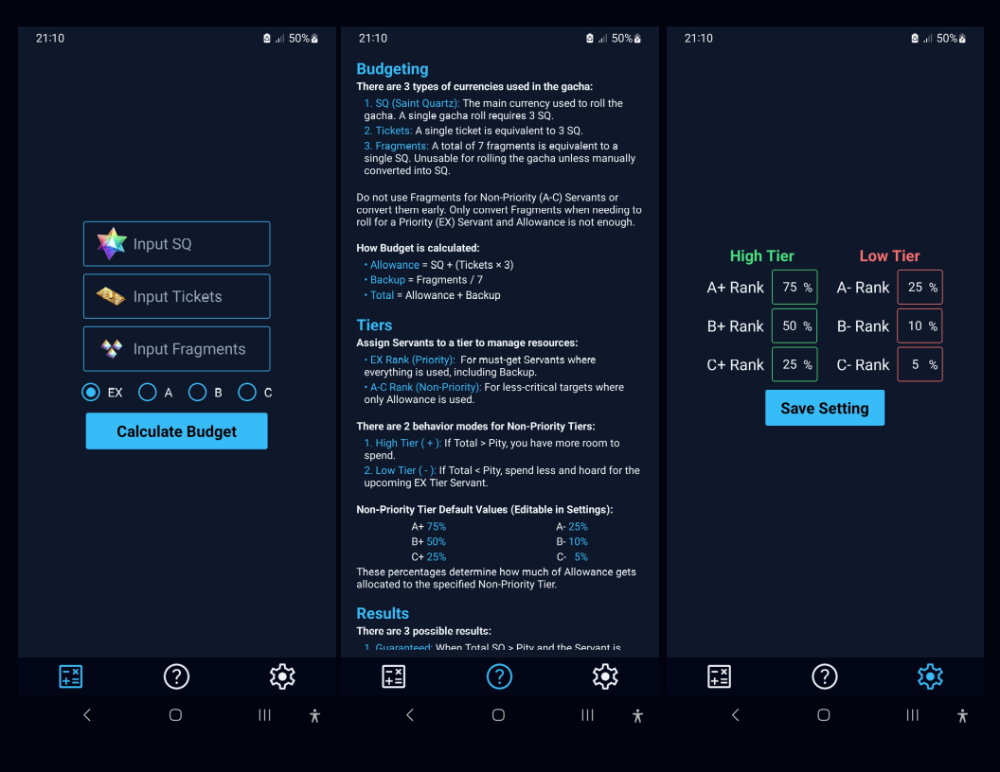

# fgo-budget

A simple personal budgeting app for Fate/Grand Order.

When rolling for a character in the gacha, it is easy to get caught up in the
hype and overspend your in-game currency. With this app, you can budget your
rolls, estimate your chances, and decide if rolling for a specific banner is
actually worth it.

Originally built for personal use and as a way to learn mobile development with
React Native, this app is niche and may be unintuitive for you. That said, if
you are interested in trying it out, you can install it in your Android device
by referring to the [installation instructions](#installation) below.

### Preview

  
  
Screenshots taken from Samsung Galaxy A32

## Features

- Gacha Roll Simulation: Simulate how your rolls in the game would go based on
  your available resources and spending limits.

- Customizable Settings: Modify allocation settings based on how you want to
  budget your Servant.

- Fully Offline: Runs entirely on your device; no internet required.

## Installation

1. Go to the [Releases](https://github.com/Lanezedfer/fgo-budget/releases) page.

2. Download the latest .apk file.

3. Open the file on your Android device. Allow installation from unknown sources
   if prompted.

4. Launch the app.

## Tech Stack

- React Native (TypeScript)
- Expo

## Learning and Development Notes

### Project's Flowchart:

  

### Switching Package Managers:

I started this project with pnpm, but then Expo builds kept failing. After some
research, I concluded that pnpm is not fully compatible with Expo. Switching to
npm instantly fixed the issue. While I prefer pnpm, finishing the project with
the least complexity was more practical.

## License

This project is distributed under the MIT License. View [`LICENSE`](LICENSE) for
more information.

## Author

Lance Ezeckel P. Fernando (fernando.lance.eze@gmail.com)
